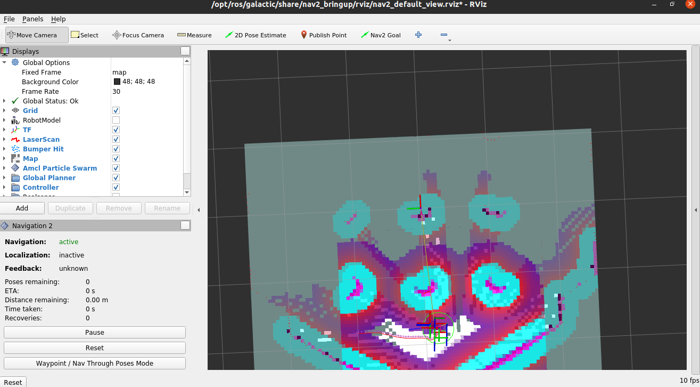

# nav2_msg_samples
Recording Nav2 input output of SLAM [example](https://navigation.ros.org/tutorials/docs/navigation2_with_slam.html#getting-started-simplification)



## Usage
Filter to specific items
```
cat topic_messages/_map.txt | grep 'width\|height\|x\|y'
```

## Custom

1. db3 file creation
```
sh ros2_bag_record.sh
```

1. playback
```
ros2 bag play subset.db3
```

1. save to txt files
```
sh ros2_topic_echo.sh
```
